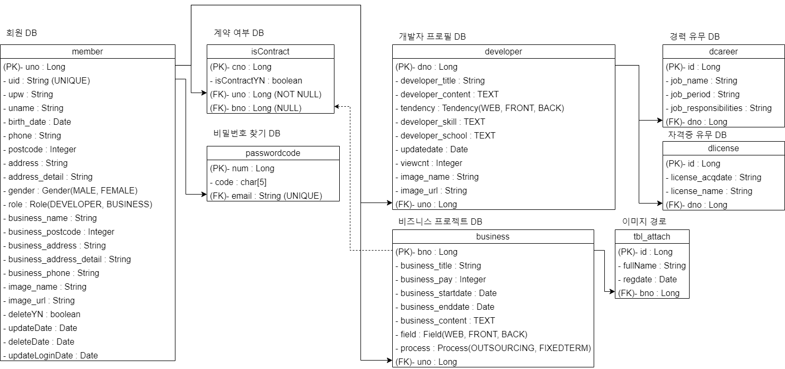
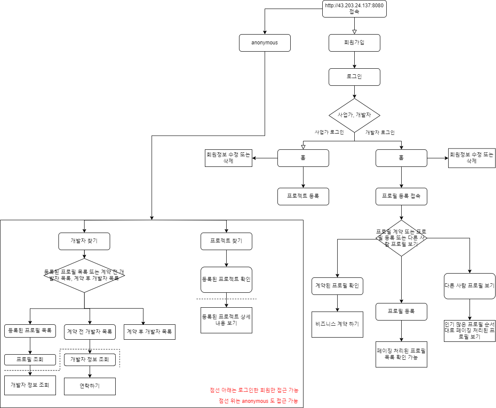
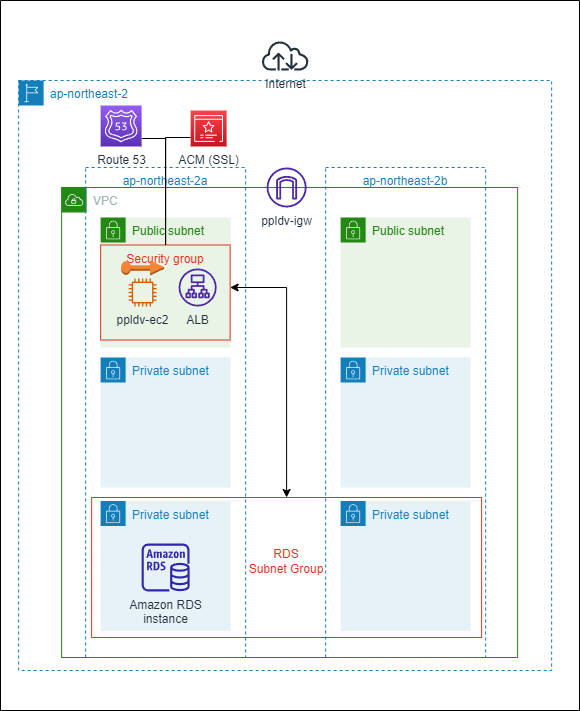

# 새로운 깨달음

``` java
@Configuration
@RequiredArgsConstructor
public class LoginSuccessHandler implements AuthenticationSuccessHandler{

	private final JwtProvider jwtProvider;
	
	@Override
	public void onAuthenticationSuccess(HttpServletRequest request, HttpServletResponse response,
			Authentication authentication) throws IOException, ServletException {

		CustomUserDetails userDetail = (CustomUserDetails) authentication.getPrincipal();
		
		Member member = userDetail.getMember();
		
		String jwtToken = jwtProvider.generateToken(authentication);
		
		/*
		Cookie cookie = new Cookie("jt", jwtToken);
		cookie.setPath("/");
		response.addCookie(cookie);
		*/
		
		response.setHeader("jwtToken", jwtToken);
		
		// 이전 요청이 POST 였기 때문에 POST로 forward 요청을 보내게 되어서 문제가 발생
		// 그래서 이러한 경우를 해결해주기 위해서는 어떻게 해야할까?
		// /success라는 post 요청처리하는 컨트롤러를 만들고, modelAndView 객체로 model의 header가 아닌 바디에 담아서 보내줘야 함.
		// 일반적으로 DispatcherServlet이 보내는 ModelAndView에 대해서는 response.addHeader와 같은 메서드로 직접 헤더 추가 불가능 ( DispatcherServlet이 일반적으로 헤더를 생성하고 관리하기 때문 -> 따라서 request.addAttribute()만 사용 가능 )
		// request.getRequestDispatcher("/success?message=loginSuccess").forward(request, response);
		
		
		// 정리
		/*
		 * 왜 jwt Token을 restful한 서버에서 사용하냐 하면,
		 * 응답에 따른 성공과 에러 처리를 한 페이지에서 처리할 수 있기 때문
		 * 만약 form을 사용하게 되면, RESTAPI로 데이터를 보내도 (프론트가) 받을 수가 없음
		 * 따라서 무조건 ModelAndView 객체로 담아서 프론트로 보내줘야 하는데, 서버에 의존성이 극심해지고, 독립성을 유지할 수가 없음
		 * 즉, 서버가 페이지를 이동하는 처리 로직을 담당하므로 서버에 부하가 많이 생김과 동시에 새롭게 process를 담당하는 추가적인 페이지도 개설해야 하므로, 프론트의 용량이 너무 커지게 됨
		 */
		
		/*
		 * 따라서 나는 이제 부터 서버에 대한 의존성을 줄이기 위해 form 태그로 작성한 코드들을
		 * 전부 다 ajax로 바꿔서 처리를 하려고 함
		 */


        // 삭제할 것 또는 추가할 것
        /*
         * login.jsp (ajax로 변경하고 성공 시, 에러 시 요청 처리 로직 추가)
         * ----> 사실 할 필요 없는데 에러 시 새로운 페이지로 요청 전달하는걸 여기서 해주자 (그냥 바로 alert 해도 되긴 하지만, 잘 구현해놓은 로직 삭제하기가 너무 아쉽다.)
         * securityConfig -> formLogin disable로
         * security에서 로그인 처리를 해주기 위한 Filter 설정 추가
         * 마지막으로 인증 처리를 담당하는 검증 Filter 설정 추가
         * 현재는 AccessToken만 설정해 두엇는데, refresh 토큰도 설정해 주자
         * (아직 아는게 많이 없어서 시간이 많이 걸릴 것이라 예상 -> + 정처기 실기도 있다 ㅜㅜ)
         */
	}
}
```

``` html
<!-- 기존 login 처리 -->
<%@ page language="java" contentType="text/html; charset=UTF-8"
    pageEncoding="UTF-8"%>
<%@ page session="true" %>
<%@ taglib prefix="c" uri="http://java.sun.com/jsp/jstl/core" %>

<link rel="stylesheet" type="text/css" href="${path}/resources/css/member/login.css"/>

<c:set var="content">
	<section>
	<form method="post" action="/user/login" id="form">
	<div class="login" id="login">
		<h1 class="login_title">로그인</h1>
		<div class="loginForm">
			<input type="text" name="email" id="email" placeholder="이메일 주소" autofocus="autofocus"/>
			<input type="password" name="password" id="pass" placeholder="비밀번호"/>
		</div>
		<div class="loginCheck">
			<input type="checkbox" name="checked" id="loginSession"/>
			<label for="checked">로그인 상태 유지</label>
			
			<a href="/user/findPass" id="test">비밀번호 찾기</a>
		</div>
		<div class="loginButton">
			<button onclick="login()">로그인</button>
			<p>계정이 없으신가요? <a href="/user/register">회원가입하기</a> </p>
		</div>
	</div>
	</form>
	</section>
</c:set>

<%@ include file="/WEB-INF/views/common/frame.jsp" %>

<script>
	function check() {
		let chkLogin = $("#loginSession");
		console.log(chkLogin.is(":checked"));
	}

	// 로그인
	function login() {
		let email = $("#email");
		let pass = $("#pass");
		let chkLogin = $("#loginSession");
		
		// 정규식
		var regexEmail = /^([\w-]+(?:\.[\w-]+)*)@((?:[\w-]+\.)*\w[\w-]{0,66})\.([a-z]{2,6}(?:\.[a-z]{2})?)$/; // 정규표현식 이메일
		
		if (email.val() === '') {
			alert('이메일을 입력해주세요.');
			email.focus();
		} else if (!regexEmail.test(email.val())) {
			alert('이메일 형식이 맞지 않습니다.');
			email.val('');
			email.focus();
		} else if (pass.val() === '') {
			alert('비밀번호가 입력되지 않았습니다.');
			pass.focus();
		} else {
			$("#form").submit();
		}
	}

</script>

<!-- 수정한 로그인 페이지 -->
```


# ING
- Spring Security 적용 중 - jwt 토큰이랑 함께 적용 (시간이 좀 걸릴 것이라 예상)


- TODO : 권한 처리 (완료) (https://gyumingomin.tistory.com/8)

- TODO2 : session -> jwt (작업 중)
    - form 태그로 결합성을 높인 부분들을 다 ajax로 교체해서 결합도 낮추자!!!
    - 기존 서버에서 페이지 이동을 해줬던 부분들을 프론트에서 페이지 이동으로 다 바꾸자!!! (허걱!!)

- TODO3 : jwt -> OAUTH2

- TODO4 : business logic 작성

- TODO5 : 코드 검증

- TODO6 : CI/CD 구현 및 autoScaling 으로 배포


# 발생하는 오류 (V2에서 수정 예정)
```
> 회원가입 시, interceptor에서 처리하는 권한 관련된 메시지들을 response로 전달 받는 한글 UTF-8 적용 안되고 있음
    -> V1.0.2 해결 완료 (https://blog.naver.com/ool9898/223389905556)

> 프로젝트 등록 페이지 validation 코드를 짜지 않아서 입력되는 값이 없을 때 500 에러 발생

> 로그인 할 시 잘못된 계정 정보로 로그인하면 서버에 에러 메시지가 뜨고 있던데 확인이 필요(서버가 가동하는 데는 문제 없음)

> 프론트 작업(개발자 등록 시 다른 사람 프로필 보기에서 2페이지를 클릭하면 페이지가 리로드 되면서 등록된 프로필 보기로 이동하게 됨 여기서 다른 사람 프로필 보기 누르면 페이징 처리가 잘 되고 있는 것을 확인 가능)
    -> V1.0.3 해결 완료 (기존 document 업로드 될 때 조건 로직 추가)
    
> Route53 ssl/tls 적용 문제 --> 노션 페이지 참고 (https://tremendous-crocus-4a0.notion.site/Route53-55f0a8e8bc5c4f38a5f3993100dc88cc?pvs=4)


- 이거때문에 4일을 갈아 넣었는데도 해결이 안되네........... 정리에서 블로그에 올려야겠다 (추가적인 문제점도 발견했으니)
```

# 후에 추가될 업데이트 버전 (V2)
```
> 코드 리팩토링(try-catch 예외처리) - 적용 완료

> Spring Security 적용시켜서 권한 적용시켜보기

> S3에 저장되고 있는 폴더 경로가 지정되어 있지 않아 찾기가 번잡 (저장 시 폴더 경로 지정)

> 서버에 저장되고 있는 프로젝트 등록 파일 또는 이미지를 S3로 옮기도록 조정 예정

> 프로젝트 수정과 삭제 구현

> 프로젝트 찾기 구현
```

# 후에 추가될 업데이트 버전 (V3)
```
> 좀 더 세련된 디자인으로 홈페이지 구성

> 프로젝트 등록 후 계약 체결 로직 구현 예정
```

# 과연 할 수 있을까..(V4...)
```
- Jsp 연동방식 React로 변환 (시간이 많이 걸릴 것이라 예상)
```

# DB 다이어그램


# 피그마 페이지
<a href="https://www.figma.com/file/T7KEgv4NuViS8cwPf4S3L3/PEOPLE.DRIVER?type=design&node-id=0%3A1&mode=design&t=3vQVC9808Ltxab2s-1">피그마 페이지 링크</a>

# 웹 사이트 로직 흐름


# AWS Architecture


# 실행 영상
<a href="https://youtu.be/vMHdKvY89Lk"> S3에 업로드 하는 영상 </a> <br/>
<a href="https://youtu.be/vMHdKvY89Lk"> 에러 404, 405 처리 페이지 </a> <br/>
<a href="https://youtu.be/vMHdKvY89Lk"> 권한 관련된 영상 (간단 축약) </a> <br/>
<a href="https://youtu.be/vMHdKvY89Lk"> 전체 시연 영상 </a> <br/>

# 간단한 소개
개발자로의　ｒｏａｄ를　걷는　길에　프리랜서는　무엇을　하는　걸까？라는　질문에서　시작하여，　우리는　개발자들이　많은　참여　기회와　소통의　폭을　넓힐　수　있는　플랫폼을　만들고자　하였습니다．　이　플랫폼을　통해　개발자들은　마음껏　다양한　프로젝트를　경험하고，　편안하게　업무를　수행할　수　있는　환경을　제공받을　것을　목표로　합니다．

# 운영중인 사이트
<a href="http://43.203.24.137:8080">PEOPLE.DRIVER </a>


# 발표 ppt와 발표 자료 및 포트폴리오 자료
<a href="https://drive.google.com/drive/folders/1oT8zLsgzaDR7fEcAwtLTcFsmb_s1rQBm?usp=sharing">PEOPLE.DRIVER PPT</a>


<br/><br/><br/>


# Docker

## 가상화와 컨테이너

### 명령어

- docker image ls (도커 이미지 검색)

- docker image pull [mysql:latest] (도커 이미지 가져오기) (현재는 mysql)

- docker container ls (실행중이거나 실행중지된 컨테이너 검색)

- docker run --name=[이름] -d -p 8080:8080 nginx:latest (nginx 실행 8080포트로) (-d 옵션은 여러개 포트) (-p 옵션은 현재 로컬 포트) (이미지 기반의 컨테이너 생성)
    - docker run --name=[] -d -p 8080:8080 [내 계정의 Dockerhub-ID/name:TAG(v1)]
    - docker run --name=[] -d -p 8080:8080 [내 계정의 Dockerhub-ID/name:TAG(v2)]

- docker image rm [IMAGE:TAG] (이미지 삭제)

- docker container rm [name] (컨테이너 삭제)
    - 실행중인 컨테이너 삭제
        - docker container stop [name] (컨테이너 중지)
        - 중지된 거 확인 docker container ls -a
        - 중지 후 rm

- docker build -t [내 계정의 Dockerhub-ID/name:TAG] . (도커 이미지 빌드) (.은 해당 경로에 존재하는 DockerFile을 의미)

- docker push [내 계정의 Dockerhub-ID/name:TAG] (도커 이미지 내 dockerhub에 업로드)
    - 만약 push가 안된다면 권한 문제일 가능성이 큼
        - docker login (도커 로그인)
            - Username: []
            - Password: []

# 배포
- maven으로 war 빌드 파일 생성
- DockerFile과 war 파일 위치 같게 설정해서
    1. Docker build (로컬 윈도우)
    2. Docker push (로컬 윈도우)
    3. aws ec2에서 docker image pull (로컬 리눅스)
    4. aws ec2에서 docker run

- 참고
```
build file은 project.war로 설정하고
docker 디렉토리에서 server.xml 설정 추가
- <Context docBase="project" path="/" reloadable="true" source="org.eclipse.jst.jee.server:project"/>
```

- 지금은 이렇게 작업하지만 후에는 쿠버네티스 사용해서 작업하는 것도 테스트 해볼 예정

# 실행
1. AWS EC2 생성 후 Docker 설치
2. Dockerhub에서 이미지를 받아와서
3. 컨테이너로 실행